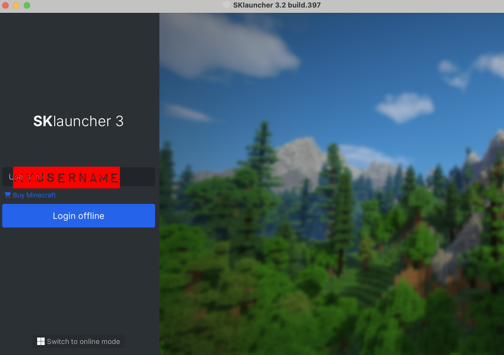
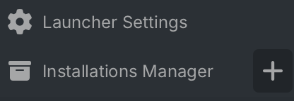
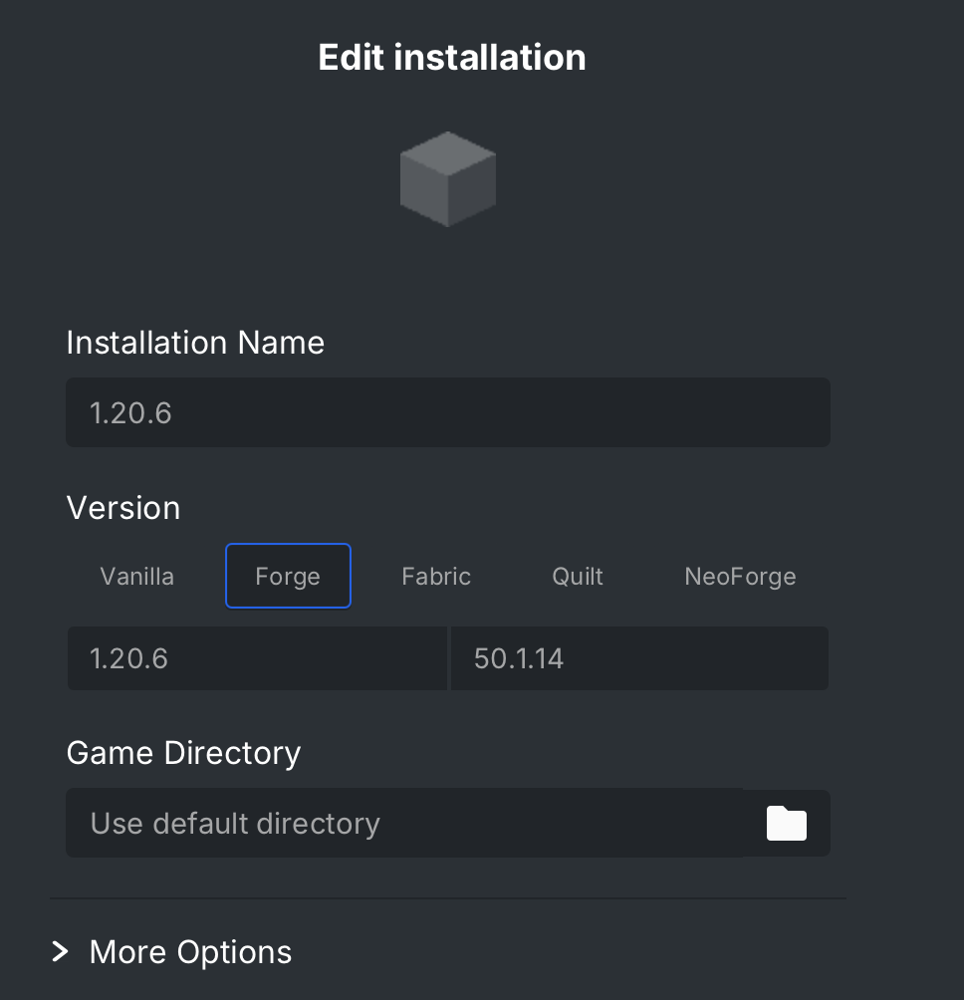
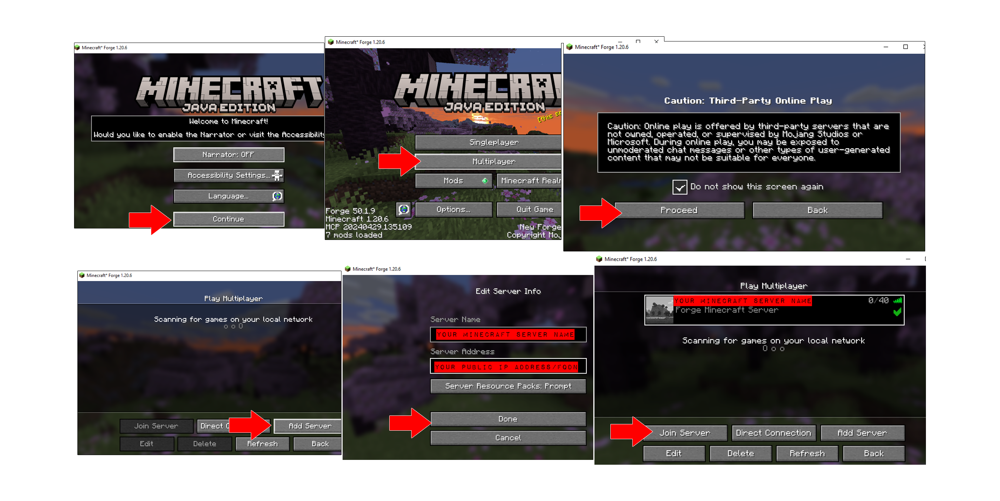
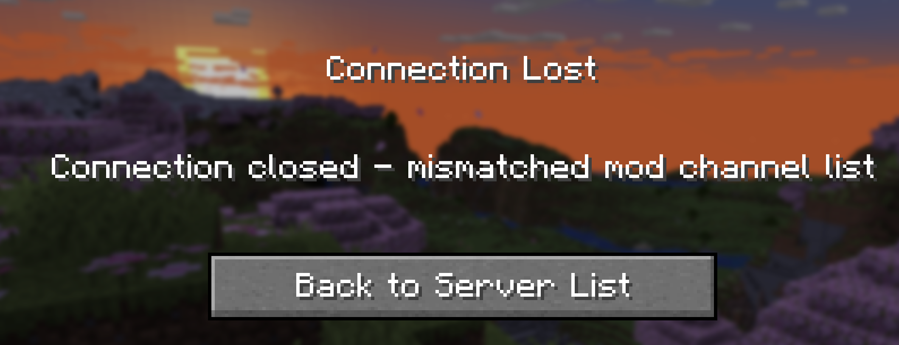

# Overview

This repository contains resources for launching a minecraft server
and a minecraft mods file host via docker, specifically via `docker-compose`.

# Docker

Make sure you've installed docker on your host.

See [docker-compose.yaml](docker-compose.yaml) for the project setup.

# Details - Hardware

- Make/Model: Intel NUC 11 Business Mini PC
- CPU: Intel Core i7-1165G7
- Memory: 64GB RAM
- Storage: 1TB SSD
- OS: Ubuntu 24.04 LTS

# Details - Minecraft

- Minecraft client: [SKLauncher](https://skmedix.pl/)
- Minecraft version: 1.20.6
- Forge version: 1.20.6
- List of MODS:
  - BiomesOPlenty-forge-1.20.6-18.4.0.8.jar
  - skinlayers3d-forge-1.6.6-mc1.20.6-all.jar
  - journeymap-1.20.6-5.10.0-forge.jar
  - TerraBlender-forge-1.20.6-3.5.0.5.jar
  - GlitchCore-forge-1.20.6-1.1.0.10.jar

# Mods

- The list of mods enabled on the server can be found in [mods.txt](mods.txt)
- Take note of the http paths:
  - These match the [mods](mods) directory structure
  - The `minecraft-mods-server` containers serves these up to the `minecraft-server`, see [docker-compose.yaml](docker-compose.yaml)
- For the mods to work, you'll need to download them via CurseForge or through some other means (use Google)
- To download the terrablender mod, for example, you'd follow the below steps:
  1. Navigate to https://www.curseforge.com/minecraft/mc-mods/terrablender
  1. Click 'View all' next to 'Game Versions'
  1. Download the version of the mod compatible with minecraft version 1.20.6
  1. Copy the mod to the [mods](mods) directory

Note: You will also need to copy these same mods to your minecraft client mods folder.

We'll cover that in the next sections.

# Launching the server

1. Ensure you have all the mods in place, as per [mods.txt](mods.txt)<br />
   Again, these should be copied to the [mods](mods) directory
1. Launch the servers via docker-compose with `docker-compose up -d`
1. Follow logs `docker-compose logs -f --tail=20`

# Launching the client & copying in the mods

By this point you should already have done the following:

1. Downloaded your minecraft client, e.g. [SKLauncher](https://skmedix.pl/)
1. Downloaded any applicable mods

Upon first launch of your client, your local minecraft profile directory should have been created.

At this point, you should be able to copy your mods to the minecraft profile's mods directory.

- On OSX, this should be `~/Library/Application Support/minecraft/mods`
- On Windows, this should be `%APPDATA%\.minecraft\mods`

You can create any of these folder's if they don't already exist.

# Launching the client & Connecting to your Minecraft Server

At this point, you should be ready to connect to your minecraft server.

## Login via Offline Mode

Ensure you login via 'offline mode', as illustrated:



Enter in a username of your choice, as there are no server-side user restrictions in place.

## Add an installation & configure forge settings

Once you've logged in, you'll need to add an installation and configure it to use forge, as illustrated:

1. Click the `+` next to _Installations Manager_<br />
   
1. From the installation details view, ensure you select Forge version 1.20.6<br />
   

## Launch installation and connect to server

At this point, you're ready to play and connect!

Follow the illusration below:



# Troubleshooting

The scenarios in the next sections are what I've encountered so far.

## Sever Error - Minecraft server is stuck during the forge installer phase

Scenario:

  - Minecraft server fails to start
  - Upon viewing the logs with `docker-compose logs`, you see something similar to the below:<br />
  ```bash
  minecraft-server ... Downloading Forge installer 50.1.0 for Minecraft 1.20.6
  minecraft-server ... Running Forge 50.1.0 installer for Minecraft 1.20.6. This might take a while...
  ```

Possible Cause:

  - The server process is unable to write to tis `/data` directory

Troubleshooting Steps:

  - Check the container logs for entries similar to `Permission Denied`
  - If you're using a volume mount for the server's data path, ensure the container has enough permissions to write to it

## Server Error - Minecraft server fails to start

Scenario:

  - Minecraft server fails to start
  - Upon viewing the logs with `docker-compose logs`, you see something similar to the below:<br />
  ```bash
  minecraft-server ... ERROR : 'mcopy' command failed. Version is 1.39.10
  minecraft-server ... me.itzg.helpers.http.FailedRequestException: HTTP request of http://minecraft-mods-server/1.20.6/TerraBlender-forge-1.20.6-3.5.0.5.jar failed with 404 Not Found: Extracting filename
  ```

Possible Cause:

  - You haven't copied the list of mods referenced in [mods.txt](mods.txt) to your [mods/1.20.6][mods/1.20.6] directory _before_ starting this `docker-compose` project
  - The mods file host container does not have sufficient permissions to the directory in which the mods are stored

Troubleshooting Steps:

  - Make sure you've downloaded any mods referenced in [mods.txt](mods.txt) and placed them in the appropriate local directory
  - Ensure all containers have enough permissions to write to their respective data directories  

## Client Error - Mismatched Mod Channel List

Scenario:

  - Upon attempting to join the Minecraft sever, your client displays the following error:<br />
    

Possible Cause:

  - You haven't copied the list of mods referenced in [mods.txt](mods.txt) to your minecraft profile's mods directory

    - On OSX, this should be `~/Library/Application Support/minecraft/mods`
    - On Windows, this should be `%APPDATA%\.minecraft\mods` 

Troubleshooting Steps:

  - Make sure you've downloaded any mods referenced in [mods.txt](mods.txt) and placed them in the minecraft profile's mods directory
